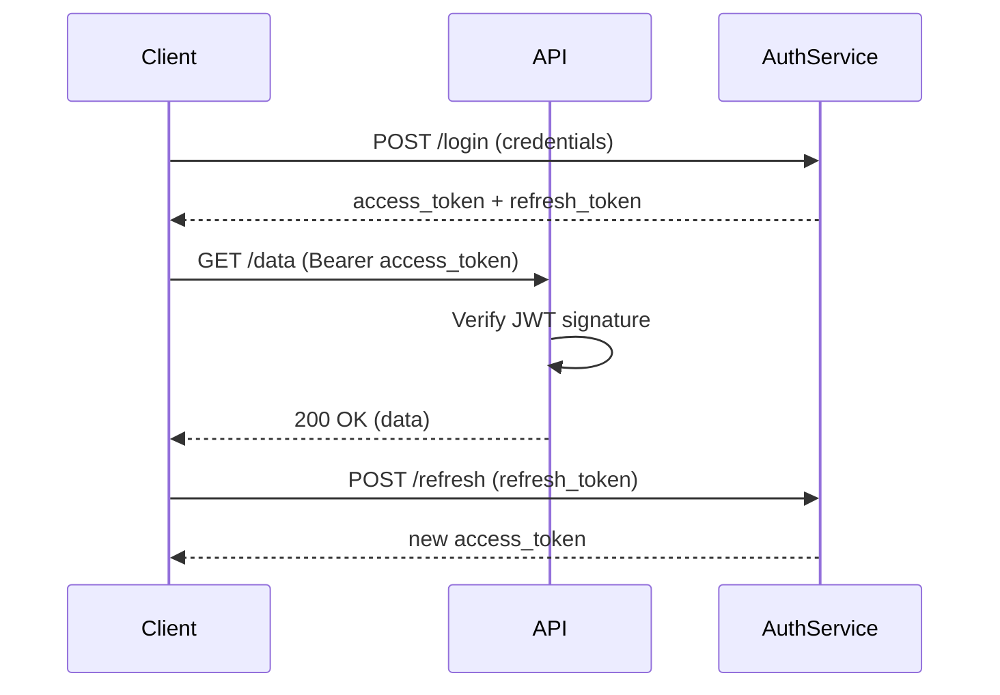

# Switch to JWT-based authentication

## Context

Our mobile team needs API authentication, and third-party partners want to integrate with our platform. Session-based auth (ADR-0001) doesn't work well for these use cases — it requires cookie support, doesn't scale for API consumers, and Redis session storage (ADR-0003) has become a single point of failure.

We need a stateless authentication mechanism that works across web, mobile, and API clients.

## Decision

We will replace session-based auth with JWT (JSON Web Tokens). Access tokens (15-minute expiry) will be issued on login, with refresh tokens (7-day expiry) stored in the database for rotation. Redis will be repurposed as a token blacklist for revocation.

## Consequences

- Good: Stateless — no server-side session lookups needed
- Good: Works natively with mobile apps and API clients
- Good: Standard format understood by third-party services
- Good: Reduces Redis dependency (blacklist only, not every request)
- Bad: Token revocation is not instant (must wait for expiry or check blacklist)
- Bad: JWT payload is readable (must not contain sensitive data)
- Bad: Larger payload than session cookies (~800 bytes vs ~32 bytes)
- Bad: Team needs to learn JWT security best practices (algorithm pinning, key rotation)
