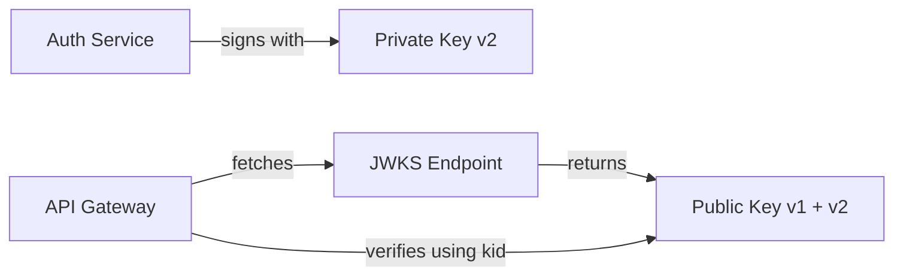

# Add JWT key rotation with JWKS endpoint

## Context

A security audit flagged that our JWT implementation (ADR-0004) uses a single static signing key. If compromised, all tokens would need to be invalidated. Industry best practice and our SOC 2 compliance requirements mandate key rotation.

## Decision

We will amend ADR-0004 by adding:
1. **Asymmetric signing** (RS256) instead of symmetric (HS256)
2. **Quarterly key rotation** with a 48-hour overlap period
3. **A JWKS (JSON Web Key Set) endpoint** at `/.well-known/jwks.json` for public key discovery
4. Each JWT will include a `kid` (Key ID) header to identify which key signed it

## Consequences

- Good: Key compromise impact is limited to one rotation period
- Good: JWKS enables zero-downtime key rotation
- Good: Third-party services can verify our tokens via JWKS
- Good: Meets SOC 2 cryptographic key management requirements
- Bad: More complex key management infrastructure
- Bad: JWKS endpoint must be highly available (cache with fallback)
