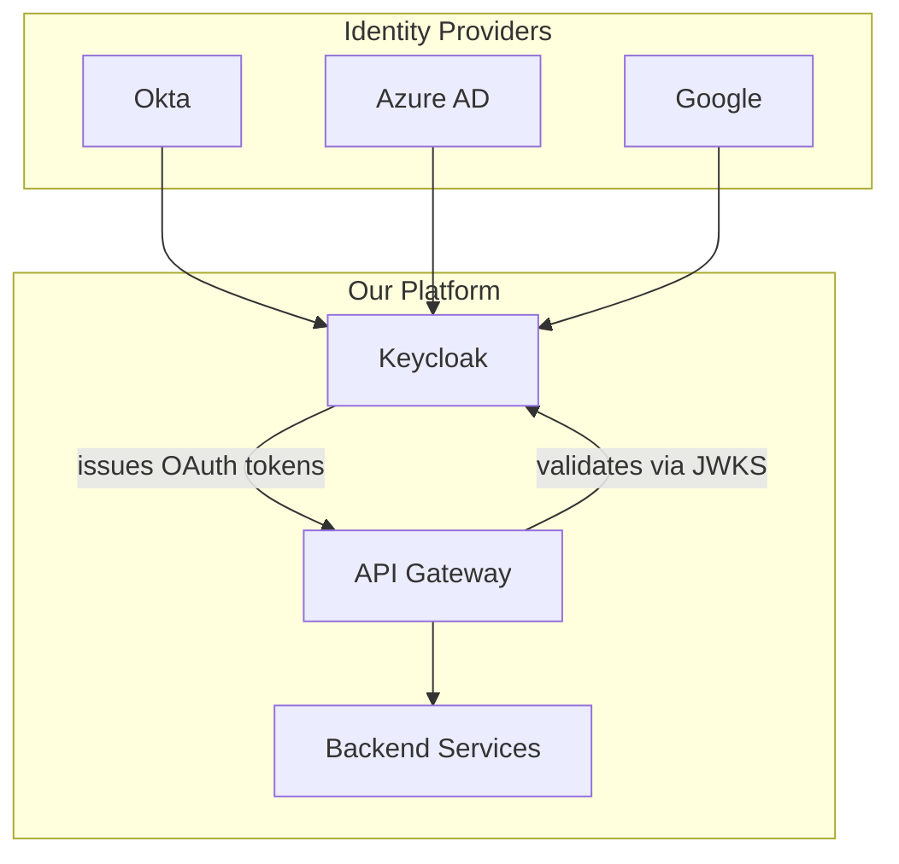

# Migrate to OAuth 2.0 with OpenID Connect

## Context

Our custom JWT auth (ADR-0004, amended by ADR-0006) works well, but enterprise customers are requesting SSO (Single Sign-On) via their corporate identity providers (Okta, Azure AD, Google Workspace). Building custom SAML/OIDC integrations on top of our JWT system is error-prone and duplicates work that standard OAuth 2.0 frameworks handle.

The key rotation and JWKS infrastructure from ADR-0006 will be preserved and reused.

## Decision

We will migrate to a standard **OAuth 2.0 + OpenID Connect** implementation, using an open-source authorization server (Keycloak) as the identity broker. This supersedes our custom JWT system (ADR-0004).

### Auth flows supported:
- **Authorization Code + PKCE** — web and mobile apps
- **Client Credentials** — service-to-service / partner APIs
- **Device Code** — CLI tools

### Migration plan:
1. Deploy Keycloak alongside existing JWT auth (dual-stack, 2 weeks)
2. Migrate internal apps to OIDC (2 weeks)
3. Migrate partner APIs to Client Credentials flow (2 weeks)
4. Decommission custom JWT auth endpoint (1 week)

## Consequences

- Good: Enterprise SSO out of the box (Okta, Azure AD, Google, etc.)
- Good: Standard OAuth 2.0 flows — no custom auth code to maintain
- Good: Preserves JWKS infrastructure from ADR-0006
- Good: Centralized user management and consent screens
- Good: Built-in MFA support via identity providers
- Bad: Keycloak is a heavy dependency (~500MB Docker image)
- Bad: Adds latency for the initial auth redirect flow
- Bad: Team needs OAuth 2.0 / OIDC expertise
- Bad: Migration requires a dual-stack transition period
