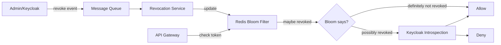

# Centralized token revocation service

## Context

With OAuth 2.0 (ADR-0007), we inherit the same token revocation challenge we had with JWTs — access tokens are valid until expiry. Our compliance team requires the ability to revoke any token within 30 seconds for incident response. Keycloak's built-in revocation checks add too much latency when called on every request.

We still have Redis in our stack (ADR-0003) and rate limiting infrastructure (ADR-0005) that can be leveraged.

## Decision

We will amend our OAuth 2.0 implementation (ADR-0007) with a dedicated **token revocation service** backed by Redis:

1. A **revocation bloom filter** in Redis, checked on every request (~0.1ms overhead)
2. An **event-driven revocation pipeline**: when a token is revoked in Keycloak, an event is published to our message queue, which updates the bloom filter across all API gateway instances
3. False positives from the bloom filter trigger a full Keycloak introspection call (rare, ~1% of revoked tokens)

## Consequences

- Good: Token revocation takes effect within 30 seconds (meets compliance)
- Good: Minimal per-request overhead (~0.1ms bloom filter check)
- Good: Reuses existing Redis infrastructure
- Bad: Bloom filter has a small false-positive rate (~1%)
- Bad: Adds architectural complexity (message queue, bloom filter sync)
- Bad: Requires careful bloom filter sizing and rotation
