# Add passkey (WebAuthn) authentication support

## Context

Passwords remain the weakest link in our auth chain, even with OAuth 2.0 and SSO (ADR-0007). Phishing attacks against our users increased 300% in Q4 2024. The FIDO Alliance's WebAuthn standard enables passwordless authentication using biometrics and hardware keys, and is now supported by all major browsers and mobile platforms.

Our JWKS infrastructure (ADR-0006) and OAuth 2.0 framework (ADR-0007) provide a solid foundation to add passkeys as an additional authentication method.

## Decision

We propose amending our OAuth 2.0 implementation (ADR-0007) to support **passkeys via WebAuthn** as a first-class authentication method in Keycloak:

1. **Registration flow**: Users can register passkeys (Touch ID, Face ID, Windows Hello, hardware keys) from their account settings
2. **Login flow**: Passkey authentication is offered as the primary option, with password as fallback
3. **Cross-device support**: Enable hybrid transport for passkey authentication across devices
4. **Progressive rollout**: Opt-in for all users, mandatory for admin accounts within 90 days

```mermaid
sequenceDiagram
    participant User
    participant Browser
    participant Keycloak
    participant Authenticator

    User->>Browser: Click "Sign in with Passkey"
    Browser->>Keycloak: Begin authentication
    Keycloak-->>Browser: Challenge (PublicKeyCredentialRequestOptions)
    Browser->>Authenticator: Request assertion (biometric/PIN)
    Authenticator-->>Browser: Signed assertion
    Browser->>Keycloak: Submit assertion
    Keycloak->>Keycloak: Verify signature against stored public key
    Keycloak-->>Browser: OAuth tokens (via Authorization Code + PKCE)
```

## Consequences

- Good: Phishing-resistant — passkeys are bound to the origin
- Good: Better UX — biometric login is faster than typing passwords
- Good: Reduces password-related support tickets (~30% of current volume)
- Good: Meets NIST SP 800-63B AAL2 requirements
- Bad: Not all users have compatible devices (need password fallback)
- Bad: Passkey management UX adds complexity to account settings
- Bad: Key synchronization across devices depends on platform (iCloud Keychain, Google Password Manager)
